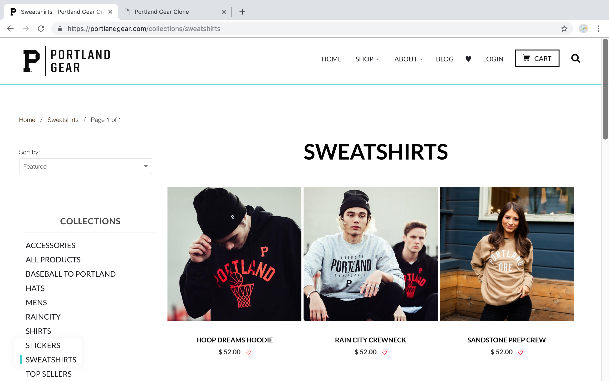
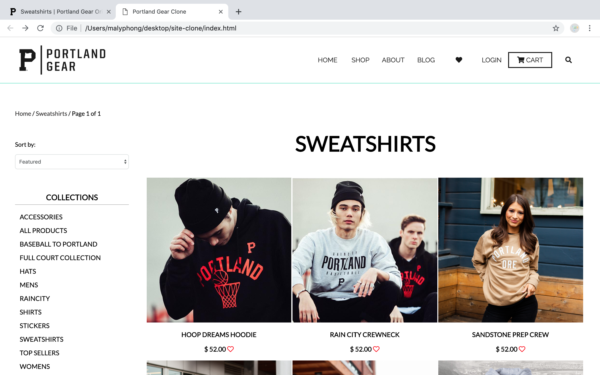

# _Portland Gear Clone (Sweatshirts)_

#### _Basic webpage clone of [Portland Gear Sweatshirts Webpage](https://portlandgear.com/collections/sweatshirts)_

#### By _**Maly Phongsavanh**_

Portland Gear | Portland Gear Clone
--------------- | -------------
 |

## Description

_This webpage uses sass to style the html clone of [Portland Gear Sweatshirts Webpage](https://portlandgear.com/collections/sweatshirts). The sass file shows use of mixins and variables with sass/css properties, media queries and also gives the designer a copious amount of practice using flex properties._

## Hosted with [GH-Pages](https://malyphong619.github.io/Portland-Gear/)

## Setup/Installation

* _Clone from github [Portland Gear Clone Repository](https://github.com/MalyPhong619/Portland-Gear.git)_

## Support and contact details

_If there are any questions or would like to contribute to the code, please feel free to email [Maly Phongsavanh](mailto:phongsavanh619@icloud.com)_

## Technologies Used

* _ATOM -text editor-_
* _HTML_
* _CSS_
* _SASS_

### License
_This software is licensed under the MIT license_*
Copyright (c) 2019 **_Maly Phongsavanh_**
